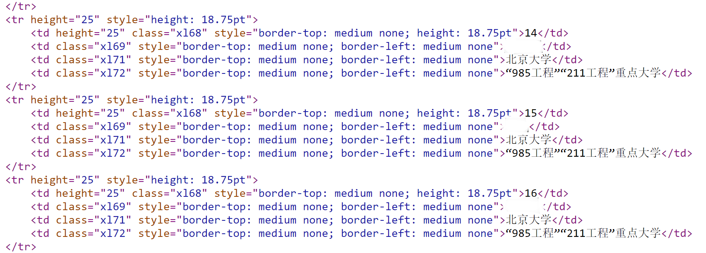
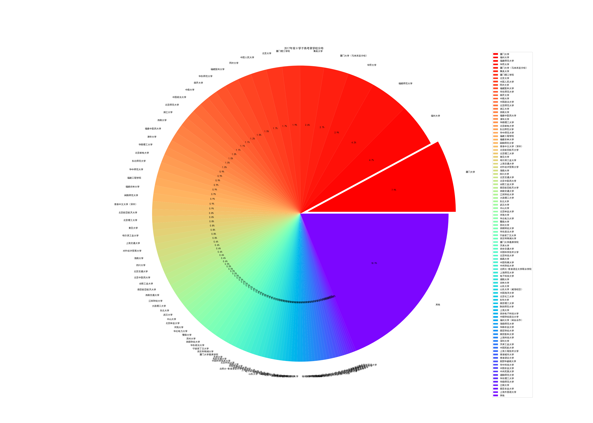
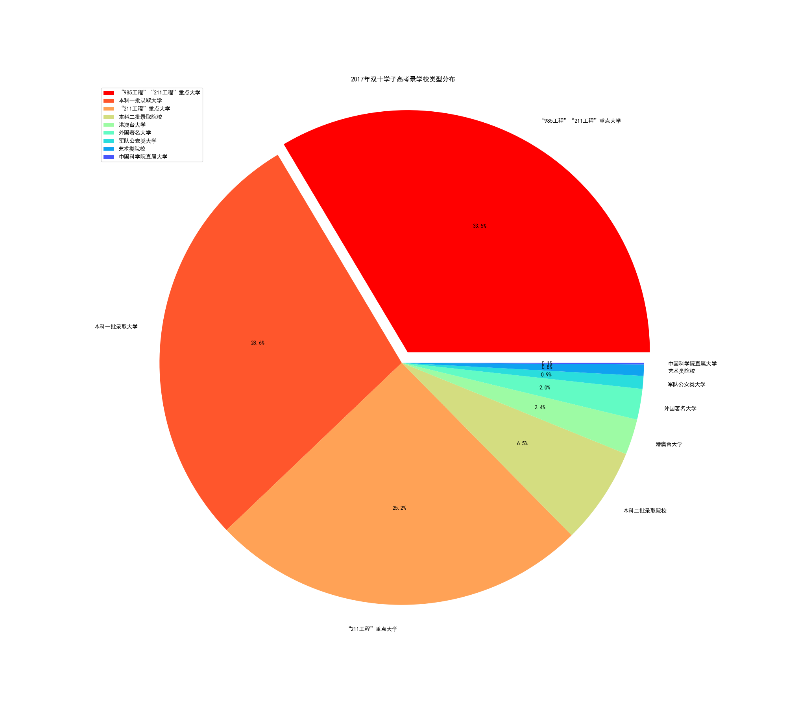
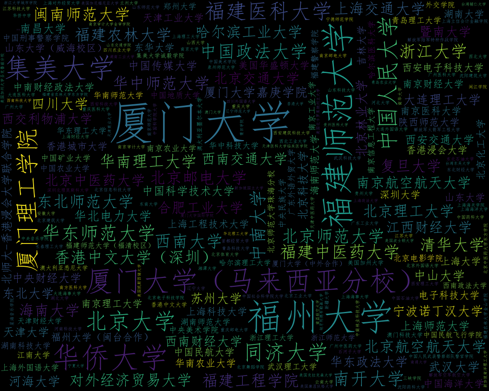

# DT 2017 analysis

**实验运用Python强大的三方库对2017双十中学的高考录取结果从网站上爬取，保存，统计，最终得到关于2017级学生去向的分析．**

# 设计方案：

- # file: my_html.py  # 爬取并处理HTML信息 

首先，我通过request库获取了从网站上爬取的HTML信息．先前的测试中发现服务器并不是很稳定，因此我在爬取的同时将信息保存在本地以防止服务器连接异常．（保存的文件仅仅作为备份，后续的操作的信息还是从网站爬取）．

接着，我使用了BeautifulSoup库对于HTML的标签进行分块提取．经过观察我选择了<tr>标签作为信息块的标志．再使用for循环从HTML中提取成员信息．对比其他网站的源代码后, 我发现其实这个网页并不是很好爬取, 因为标签使用比较混乱, 有效信息前都有大量的属性, 并且有效信息的特征并不是完全一致的. (同一属性的标签为170/171/173/174的情况出现了好几次)因此我只好放弃用re正则化的比较方便的做法, 改用find方法进行信息的提取. 同时对不需要的信息进行剔除.(continue跳过此次循环) 最终将处理后的有效信息返回. 之后再使用csv库, 将该信息以utf-16编码保存到csv文件中.

- # file: my_count.py  # 对有效信息的统计

在提取有效信息之后, 使用csv库对提取的信息开始统计分析. 信息包括{序号, 姓名, 录取学校, 大学类型}. 但是其中有意义的信息为录取学校和大学类型. 因此我开始统计同一学校的录取人数信息和同一类型学校的录取人数信息.

我使用for循环对于’录取学校’列和’大学类型’列进行遍历. 发现有相同类型的学校或是学校类型就计数加一. 最后在对于’录取学校’和’大学类型’的内容使用lambda进行从高到低的排序. 最后将信息输出到终端验证了一下.

- # file: my_pie.py  # 对统计结果的可视化方案(一)

在对信息进行统计后, 我认为单纯的数据并不能很好的体现统计结果. 因此, 我采用了matplotlib库中的pyplot和cm, numpy库对于统计结果进行绘图. 我调用了my_count.py文件的schooltimes_list列表和schooltypes_list列表对于数据进行二次统计. 再通过pyplot的函数绘制饼状图, 展现学生的录取学校分布和学校类型分布.
过程中需要修改显示字体, 防止乱码出现.

 
2017年双十学子高考录取学校分布
 

2017年双十学子高考录取学校类型分布

- # file: my_wordcloud.py  #对统计结果的可视化方案(二)

通过饼状图确实比较清晰的表现出数据的内容. 学校类型的分布情况十分直观. 但是我发现录取学校的分布并不是十分的均匀, 大部分学生都扎堆报考某些学校, 导致约60%的学校的学生比例小于1%(10人), 分入’其他’类之中. 因此我不得不加大饼状图的块数, 以减少过多的’其他’块过大导致的无用信息. 最终我设置了100块的饼数, 把’其他’降低到18.9%, 但是图表上的文字信息又过分紧密, 导致图片并不是十分美观. 

如何解决以上提到的问题呢? 我决定采用词云(wordcloud)对于学校信息进行可视化处理. 我首先导入了wordcloud库和matplotlib库来绘制图片. 我调用my_count.py文件中的count函数进行统计. 将统计结果保存在字典中. 因为有对于学校信息的统计结果, 因此我直接使用词频生成词云图就可以了. (generate_from_frequencies函数) 再使用pyplot显示就生成了学校信息的词云图.

其中不知道为什么不能够使用自定义图片生成带有形状的词云图. 在访问GitHub项目后仍然没有解决这个问题. (我猜想可能是因为使用的是词频生成无法使用图片.) 因此就只生成了普通的词云图.
过程中需要修改显示字体, 防止乱码出现.

# 实验分析:

1.	2017级学生主要报考’厦门大学’, ‘福州大学’, 和其他一些省内学校, 占比约25%. 外省985院校的报考比例紧随其后, 约占20%, 再之后是外省211院校和985院校的分校. 单个比例均小于1%(约10人). 小于1%的比例约有60%.说明除了省内的211及以上院校外, 省外的学校学生分布比较均匀. 

2.	2017级学生有33.5%被985工程大学所录取, 28.6%被一本院校录取, 25.2%被211工程大学录取. 6.5%被二本院校录取. 约4.4%被港澳台与国外录取. 可见超过了93.5%(88%)的学生被一本及以上的学校录取了.(不计港澳台及国外)

3.	从词云图可以看出’厦门大学’,’福州大学’,’福师大’,’北大’,’华侨’,’同济’,’人大’等有很大比例的学生. 

